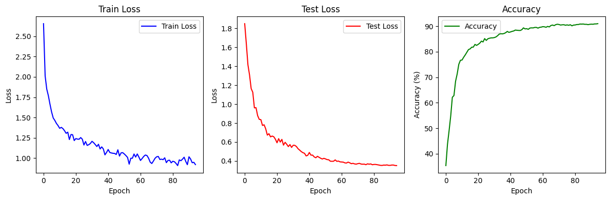

# Pytorch MobileNetV1 Optimization for CIFAR10

### Overview
This repository showcases my work on optimizing MobileNetV1 for the CIFAR10 dataset. The aim was to enhance the performance of this lightweight deep learning model while maintaining its efficiency, making it more suitable for applications in environments with limited computational resources.
* If you have questions about this repository, please send an e-mail to me (songsite123@naver.com) or make an issue.

### Project Introduction
MobileNetV1, known for its efficiency and portability, is a popular choice for mobile and edge computing. However, when dealing with specific datasets like CIFAR10, there's room for optimization to achieve better accuracy and efficiency. This project focuses on fine-tuning and optimizing MobileNetV1 specifically for the CIFAR10 dataset, which consists of 60,000 32x32 color images in 10 classes.

### Modifications and Optimizations
* Architecture Adjustments: Minor changes in the network architecture to better fit the CIFAR10 dataset.
* Hyperparameter Tuning: Extensive experimentation with learning rates, batch sizes, and other hyperparameters.
* Data Augmentation Techniques: Implementing various data augmentation methods to improve model generalization.
* Regularization Strategies: Applying dropout and other regularization techniques to prevent overfitting.

### Experiment Settings
The limitation of the whole training time is 3,600 sec.
#### Baseline MoblileNetV1
* The baseline model used in this repository follows the setting used in [kuangliu github pyorch-cifar](https://github.com/kuangliu/pytorch-cifar/blob/master/models/mobilenet.py).
* Training batch size: 100
* weight_decay = 0.0005
* epoch = 100
* Learning rate : 0.03
* Training time : 3484.9894 sec
* optimizer : SGD
* Data augmentation
  *       transforms.Pad(4),
          transforms.RandomHorizontalFlip(),
          transforms.RandomCrop(32),
          transforms.ToTensor()
      
#### CustomMobileNet
* Training batch size: 500
* weight_decay = 0.0005
* epoch = 105
* Learning rate : 0.03
* Training time : 3544.5987 sec
* optimizer : SGD
* Data augmentation
  *       transforms.Pad(4),
          transforms.RandomHorizontalFlip(),
          transforms.RandomCrop(32),
          transforms.ToTensor()

### Result
| Metric               | MobileNetV1   | MobileNetV2   | CustomMobileNet |
|----------------------|---------------|---------------|-----------------|
| Test set Accuracy (%)| 84.26         | 87.35         | **91.81**       |
| FLOPS                | 48,412,672    | 319,015,424   | **28,374,016**  |
| Total params         | 3,217,226     | 2,237,770     | **1,001,642**   |
| Total Size (MB)      | 20.25         | 76.6          | 14.41           |
| pass size (MB)       | 7.97          | 68.05         | 10.58           |
| Params size (MB)     | 12.27         | 8.54          | 3.82            |
| epoch                | 100           | 25            | 105             |
| Training time (sec)  | 3484.99       | 3439.57       | 3544.60         |
| Train batch size     | 100           | 100           | 500             |

FLOPS have been reduced from 48,412,672 in Baseline MobileNetV1 to 28,963,840 in CustomMobileNet, resulting in a decrease of 19,448,832. The total number of parameters decreased from 3,217,226 to 1,002,218, marking a reduction of 2,215,008. Test accuracy improved from 8426/10000 (84.26%) in Baseline MobileNetV1 to 9185/10000 (91.85%) in CustomMobileNet, showing an increase of 7.59%.
#### Loss/Accuracy Plot

  
   
  <em> Figure 1: Baseline MobileNetV1 Loss / Accuracy Plot </em>

#### Baseline vs CustomMobileNet
* FLOPS : 48,412,672 → 28,963,840 **[ -19,448,832 ]**
* Total Parameters : 3,217,226 → 1,002,218 **[ -2,215,008 ]**
* Test Accuracy : 8426/10000 (84.26%) → 9185/10000 (91.85%) **[ +7.59% ]**

#### Reference : 
* MobileNetV1 paper : [https://arxiv.org/abs/1704.04861]
* Mix-up augmentation : Facebookreseach mixup-cifar10 [https://github.com/facebookresearch/mixup-cifar10]
* Pruning : Towards Any Structural Pruning [https://github.com/VainF/Torch-Pruning]
